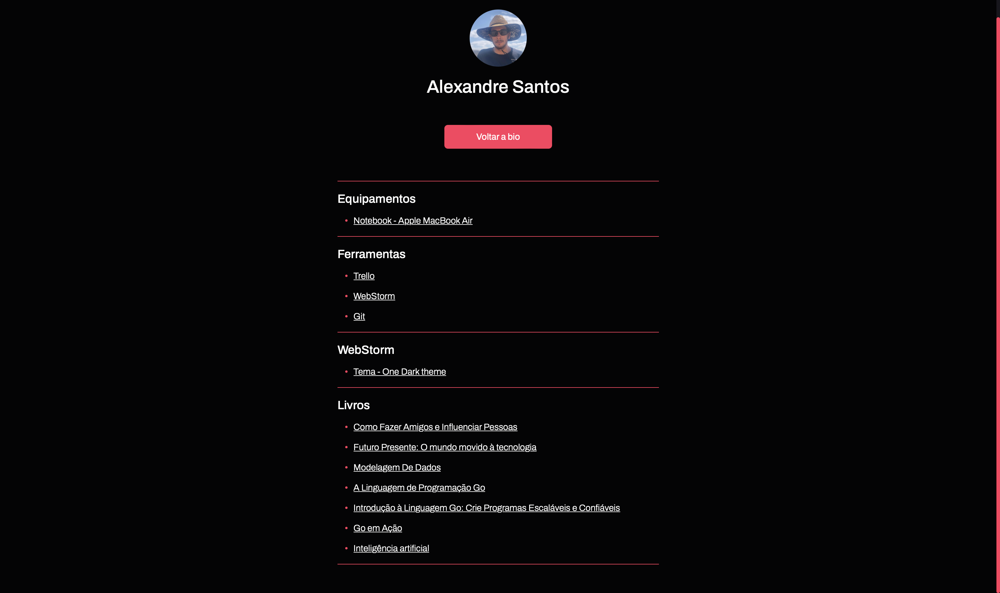

<h1 align="center">
  💻 Setup - Alexandre Santos
</h1>

<h4 align="center"><a href="https://alexandresantosal91.github.io/setup/">Clique para visitar o projeto</a></h4>

---

<h2>Autor</h2>

<table>
  <tr>
    <td align="center">
      <a href="https://github.com/alexandresantosal91">
         
        
          <b>Alexandre Santos</b>
        
      </a>
    </td>
  </tr>
</table>
